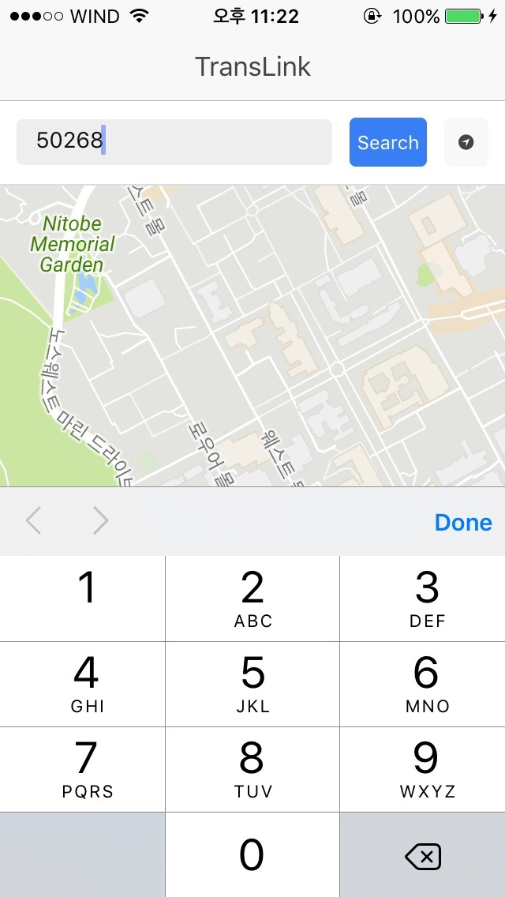
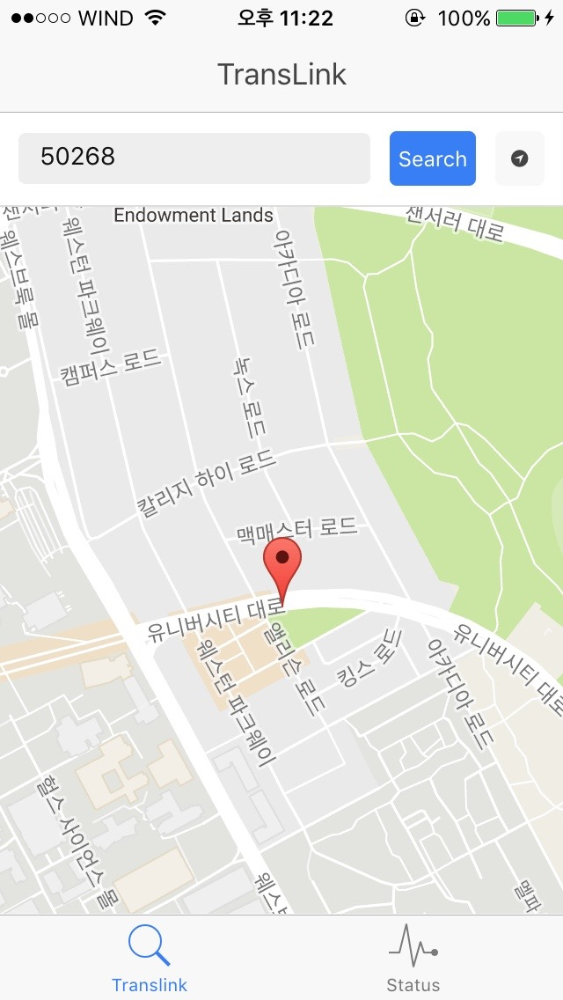
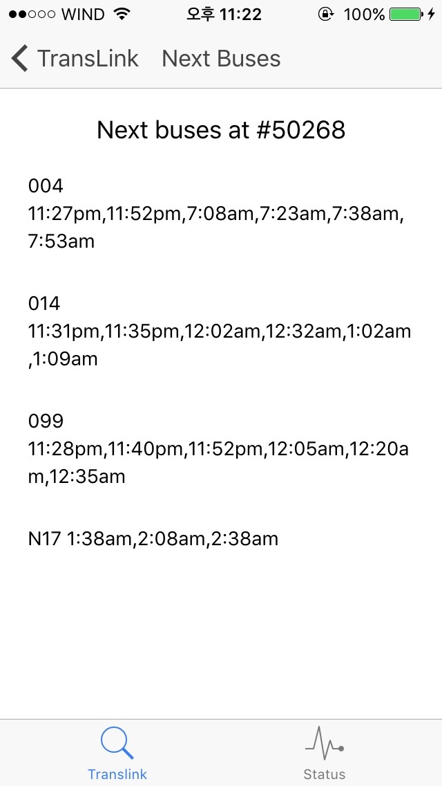
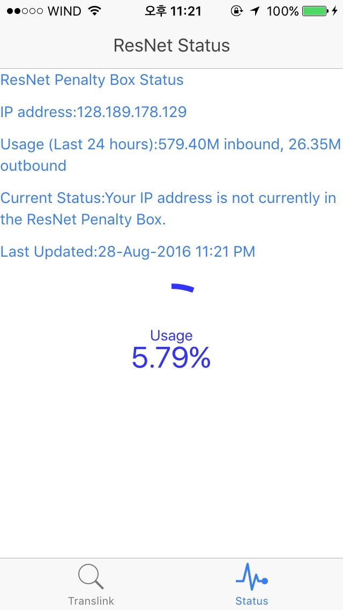

# AIO
AIO is my personal project to make an ios application using Ionic framework and AngualrJS.

Translink Tab

Users put 5 digit bus stop number and get the information of next buses coming to the bus stop.

Status Tab

The Penalty Box is an automated system that determines when someone on ResNet has exceeded their traffic quota for the last 24 hours. When someone has gone over quota, their network speed for all off-campus traffic is limited. These limits are removed when the Penalty Box determines that the individual's traffic for the last 24 hours has fallen below 10 GB. This app shows graphically how much of the quota has been used.

